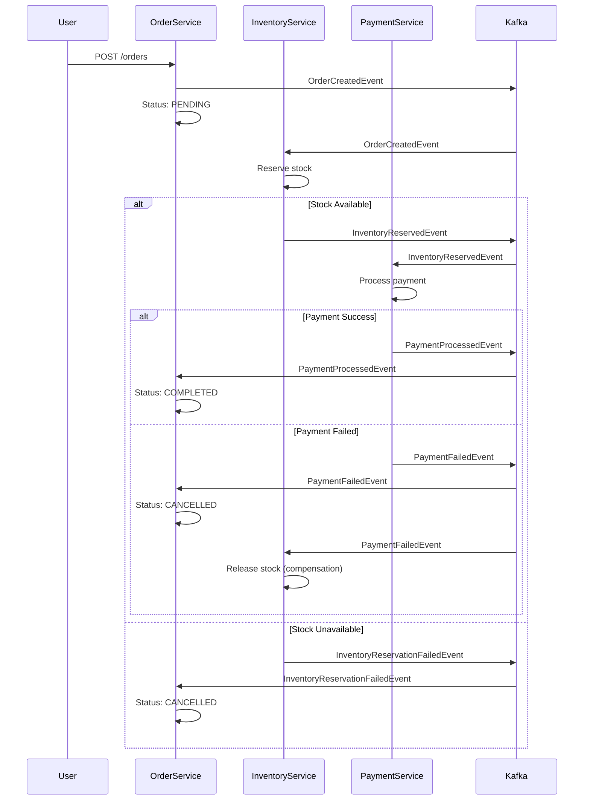

# Event-Driven E-commerce Marketplace Simulator

A high-quality demo project showcasing **distributed transactions** using the **Saga pattern** over **Apache Kafka** in a microservices architecture. This is a simulator/demo project, not a production e-commerce store.

## 🏗️ Architecture Overview

This project demonstrates a **choreography-based Saga pattern** where microservices communicate asynchronously via Kafka events, without a central orchestrator. The flow is driven entirely by events.

### Microservices

1. **Order Service** (Port 8081)
   - Orchestrates the order lifecycle
   - Publishes `OrderCreatedEvent`
   - Listens for inventory and payment events
   - Manages order state transitions

2. **Inventory Service** (Port 8082)
   - Manages product catalog and stock levels
   - Listens for `OrderCreatedEvent`
   - Publishes `InventoryReservedEvent` or `InventoryReservationFailedEvent`

3. **Payment Service** (Port 8083)
   - Processes payments
   - Listens for `InventoryReservedEvent`
   - Publishes `PaymentProcessedEvent` or `PaymentFailedEvent`
   - Simulates failures (20% chance) for demonstration

4. **Frontend** (Port 5173)
   - React 18 + Vite application
   - Product browsing and checkout flow
   - Real-time order status updates

### Technology Stack

- **Backend**: Java 21, Spring Boot 3.3+, Maven
- **Messaging**: Apache Kafka (bitnami/kafka)
- **Database**: PostgreSQL (per-service or shared schema)
- **Resilience**: Resilience4j (Circuit Breaker + Retry)
- **Documentation**: Springdoc OpenAPI (Swagger UI)
- **Testing**: JUnit 5 + Testcontainers
- **Frontend**: React 18, Vite, Axios, TanStack Query
- **Containerization**: Docker + docker-compose

## 📊 Saga Pattern Flow

The Saga pattern ensures distributed transaction consistency through compensating actions when failures occur.

### Happy Path Flow

```
1. User creates order → Order Service
   ↓
2. OrderCreatedEvent published to Kafka
   ↓
3. Inventory Service consumes event → reserves stock
   ↓
4. InventoryReservedEvent published
   ↓
5. Payment Service consumes event → processes payment
   ↓
6. PaymentProcessedEvent published
   ↓
7. Order Service updates order → COMPLETED
```

### Failure Scenarios & Compensation

```
Scenario 1: Inventory Reservation Fails
- Inventory Service → InventoryReservationFailedEvent
- Order Service → Order status → CANCELLED
- No compensation needed (no stock reserved)

Scenario 2: Payment Fails
- Payment Service → PaymentFailedEvent
- Order Service → Order status → CANCELLED
- Inventory Service listens → releases reserved stock (compensation)
```

### Mermaid Diagram



## 🚀 Quick Start

See [QUICKSTART.md](QUICKSTART.md) for detailed setup instructions.

### Quick Start (Docker Compose)

```bash
# Start infrastructure
docker-compose up -d kafka zookeeper postgres

# Start all services
docker-compose --profile services up --build
```

Access:
- Frontend: http://localhost:5173
- Order Service Swagger: http://localhost:8081/swagger-ui.html
- Inventory Service Swagger: http://localhost:8082/swagger-ui.html
- Payment Service Swagger: http://localhost:8083/swagger-ui.html

## 🧪 Testing

### Integration Tests with Testcontainers

Run integration tests that spin up Kafka and PostgreSQL containers:

```bash
mvn test
```

### Manual Testing

1. **Create an order via Swagger UI**:
   - Go to http://localhost:8081/swagger-ui.html
   - POST `/orders` with order details
   - Monitor Kafka topics and service logs

2. **Check order status**:
   - GET `/orders/{id}` to see order state transitions

## 📁 Project Structure

```
ecommerce-kafka-saga/
├── order-service/          # Order orchestration service
│   ├── src/
│   │   ├── main/java/com/example/order/
│   │   │   ├── domain/     # Order entity, OrderStatus enum
│   │   │   ├── application/ # Order service, event handlers
│   │   │   ├── infrastructure/ # Kafka producers/consumers, JPA repos
│   │   │   └── web/        # REST controllers
│   │   └── resources/
│   └── pom.xml
├── inventory-service/       # Inventory management service
├── payment-service/         # Payment processing service
├── frontend/                # React + Vite application
├── docker-compose.yml       # Local development infrastructure
├── pom.xml                  # Parent POM
└── README.md
```

## 🔧 Configuration

### Kafka Topics

- `order-events`: Order lifecycle events
- `inventory-events`: Inventory reservation events
- `payment-events`: Payment processing events

### Database

Each service uses PostgreSQL. For simplicity, you can use:
- **Option 1**: Shared PostgreSQL with separate schemas per service
- **Option 2**: Separate PostgreSQL instances per service (recommended for true microservices)

## ☁️ AWS Deployment (Free Tier)

### Infrastructure Options

1. **AWS ECS Fargate** (Serverless containers)
   - Use ECS Task Definitions for each service
   - AWS RDS PostgreSQL (free tier eligible)
   - Amazon MSK (Managed Kafka) or self-hosted Kafka on EC2

2. **AWS App Runner** (Simpler, serverless)
   - Containerized services
   - Auto-scaling
   - Free tier: 5 GB-hours/month

3. **EC2 Free Tier** (t2.micro instances)
   - Manual setup of Kafka, PostgreSQL, and services
   - More control, more maintenance

### Deployment Steps (High-Level)

1. **Build Docker images** for each service
2. **Push to ECR** (Elastic Container Registry)
3. **Create ECS Task Definitions** or App Runner services
4. **Set up RDS PostgreSQL** (free tier: db.t3.micro)
5. **Deploy Kafka** (MSK or EC2)
6. **Configure VPC, Security Groups, Load Balancers**
7. **Update service configurations** with AWS endpoints

See [docs/AWS_DEPLOYMENT.md](docs/AWS_DEPLOYMENT.md) for detailed AWS deployment instructions.

## 🎯 Key Features Demonstrated

- ✅ **Saga Pattern** (Choreography style)
- ✅ **Event-Driven Architecture** (Kafka)
- ✅ **Distributed Transactions** with compensation
- ✅ **Resilience Patterns** (Circuit Breaker, Retry)
- ✅ **Idempotency** (idempotency-key headers)
- ✅ **API Documentation** (OpenAPI/Swagger)
- ✅ **Integration Testing** (Testcontainers)
- ✅ **Microservices Best Practices**

## 📝 License

This is a demo/portfolio project for educational purposes.

## 🤝 Contributing

This is a portfolio project. Feel free to fork and adapt for your own learning!
